## 這是一款主打 資訊自主權 的交友 App —— 使用者可以自由決定「誰能看到什麼」、「是否曝光互動數據」，打造一個安全、無壓力、無演算法干擾的交友空間。

## 🛠 技術棧
| 分類    | 使用技術                                      |
| ----- | ----------------------------------------- |
| 前端    | React Native + Expo                       |
| 狀態管理  | React Context + 自訂 Hooks                  |
| 後端服務  | Supabase（PostgreSQL / Auth / Realtime）    |
| 會員系統  | Supabase Auth（Email 註冊／登入）                |
| 導航    | React Navigation                          |
| UI 樣式 | Styled Components / Tailwind React Native |

## 技術採用 React Native + Supabase，支援跨平台與即時資料互動，核心功能包括：

🧑‍🤝‍🧑 好友邀請與管理（非好友無法互動）

📝 發文與自訂權限（公開／好友可見）

💬 僅限好友之間的一對一聊天室

🔐 多種隱私開關：隱藏已讀、按讚、留言數

🏷️ 自訂標籤與搜尋功能，讓內容更易探索

🛡️ 所有貼文的可見權限僅作者本人可知，其他使用者不會知道這篇文章是開給誰看的，避免社交壓力與尷尬。

📌 專案理念
希望成為「慢社交、重隱私」的交友平台，讓使用者可以不受演算法干擾，也不需過度暴露個人資訊，逐步建立真實連結。

## 🔐 會員系統（註冊 / 登入）
 使用 Supabase Auth 實作的會員系統，支援 Email 註冊與登入，搭配登入保護機制，保障使用者隱私與操作體驗。 
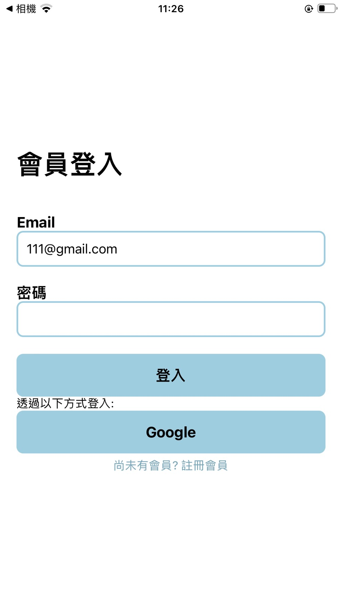
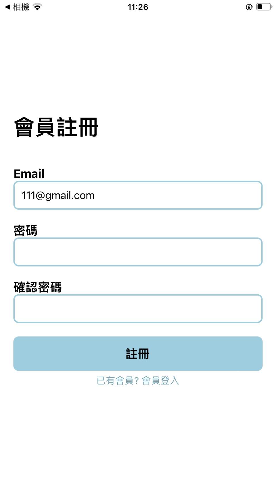

## 👤 個人資料管理
 編輯名稱、自我介紹、性別、生日、星座、興趣、喜好食物與頭貼 
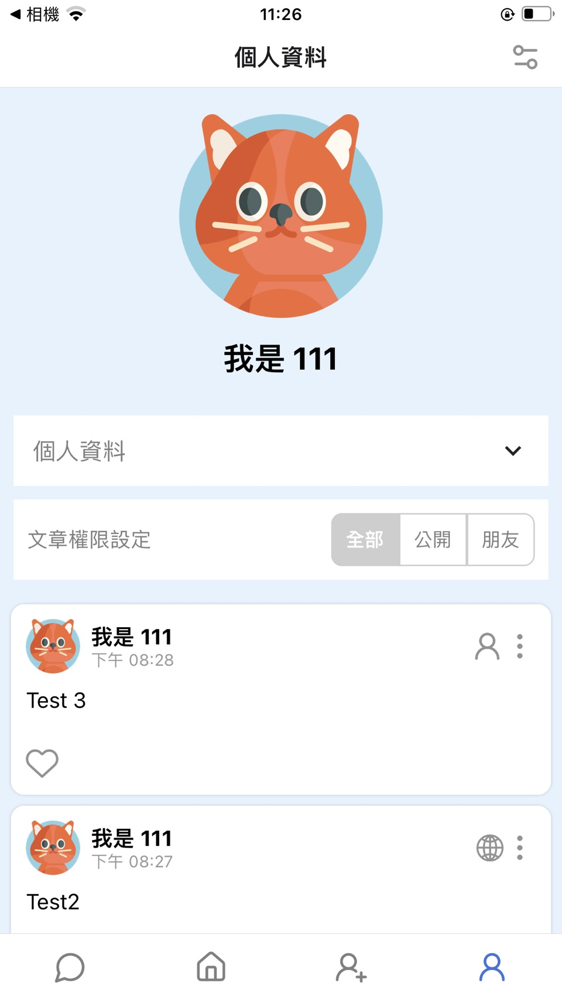
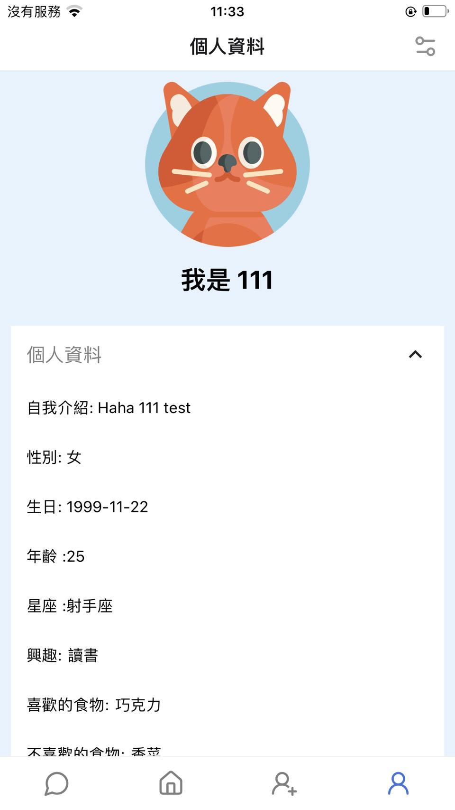
 編輯大頭貼 
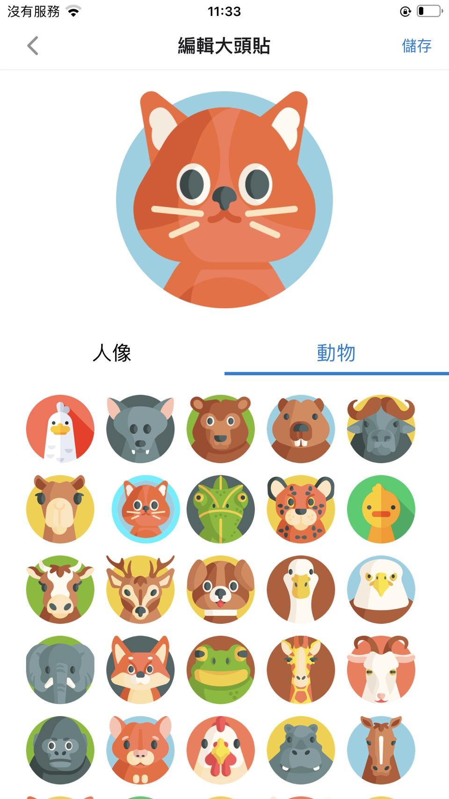

## 🤝 好友系統 
 📩 加好友與邀請機制 
 ✅雙方都同意後才會成為好友 
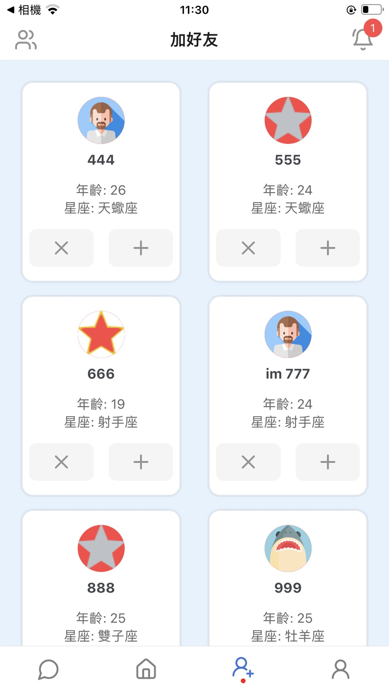
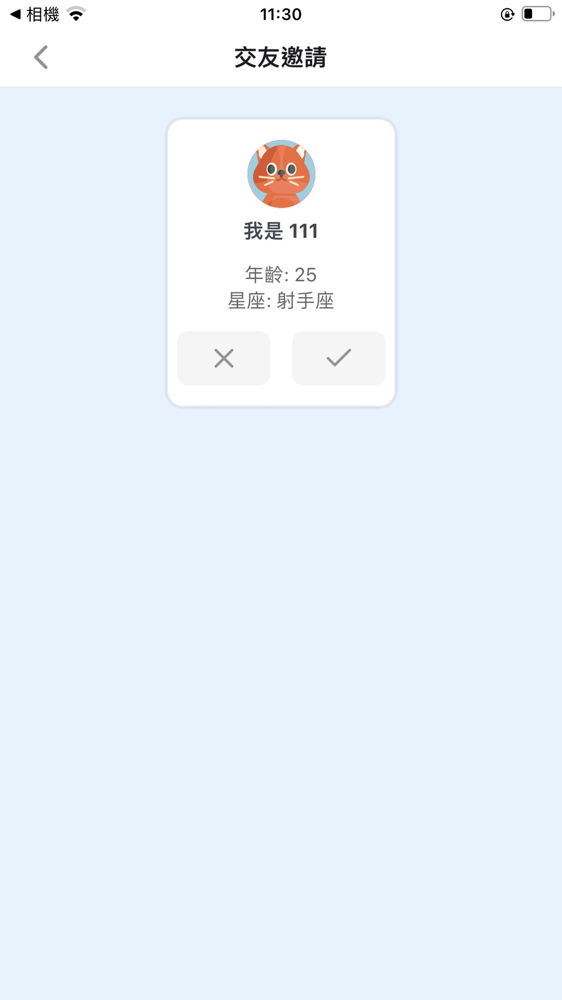
 ✅ 好友列表僅自己可見，他人無法看到你加了誰 
 ✅ 僅限雙方互為好友後，才能啟動聊天功能，避免陌生騷擾 
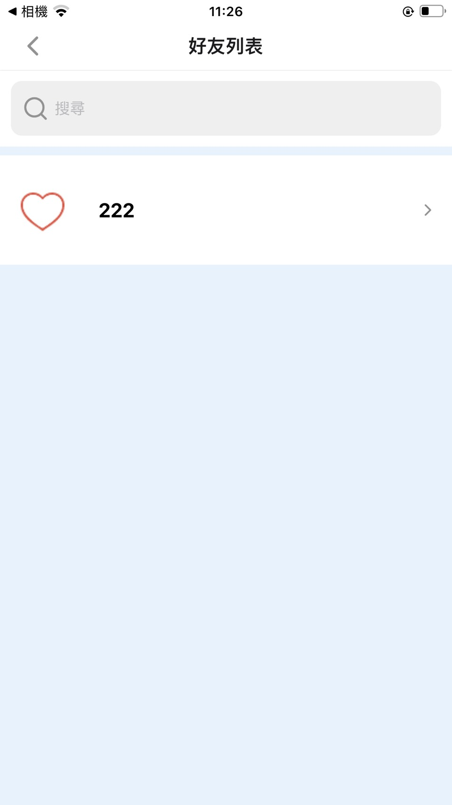
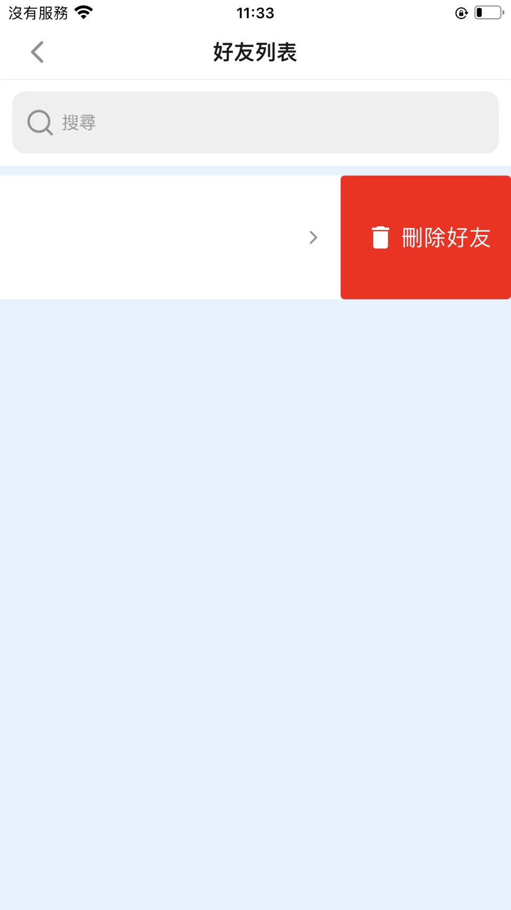 

## 📝 發文章 
 首頁僅顯示使用者有權限觀看的文章內容 
 👀 如果是「公開文章」，所有使用者都能看見 
 🔒 如果是「僅限好友」，只有文章作者的好友會在首頁看到 
 ❗其他使用者無法得知該文章的存在，也不會看到任何權限提示 
 ✅ 只有貼文作者本人能看到這篇貼文的權限設定 
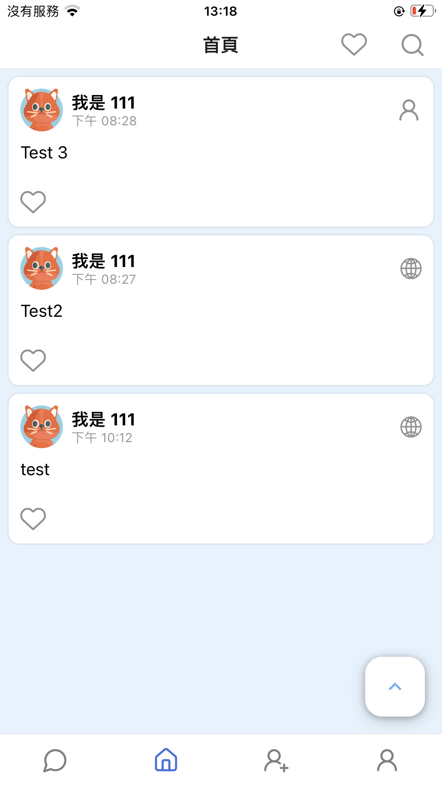
 ❌ 對於其他人的文章上不會顯示是「公開」或「限好友」，以保護作者的選擇與隱私 
 📌 此設計避免社交尷尬與標籤化，讓使用者能安心分享，不怕被「分級對待」引起誤會 
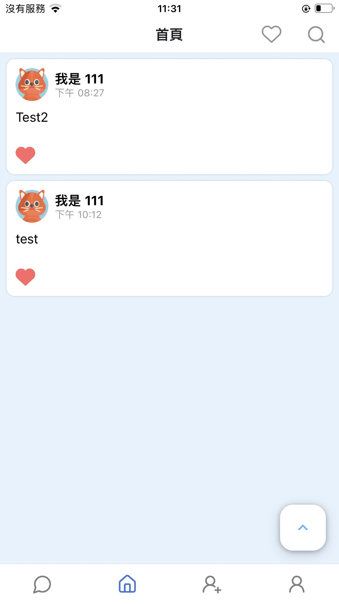
 新增文章時可自訂 多個標籤（Tags），方便他人透過標籤搜尋貼文 
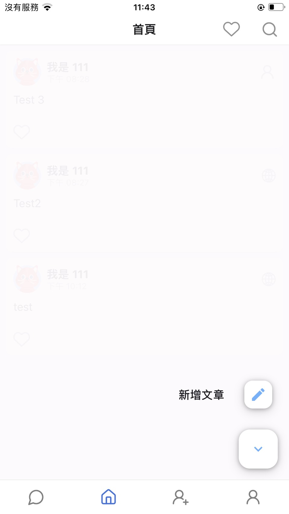
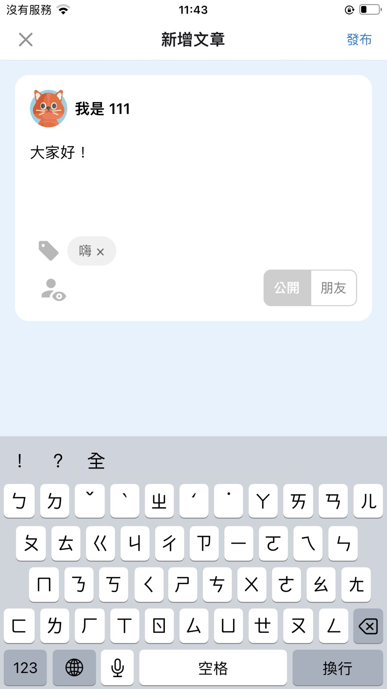

## 🔐 用戶隱私設定
 ✅ 關閉聊天室已讀標記：關閉後，對方無法得知訊息是否已讀，讓對話壓力更低 
 ✅ 隱藏貼文的按讚數：貼文發出後，其他人無法看到按讚數字，避免社交焦慮與比較 
 ✅ 隱藏貼文的留言數：僅保留內容本身，移除「熱度」干擾，聚焦交流本質 
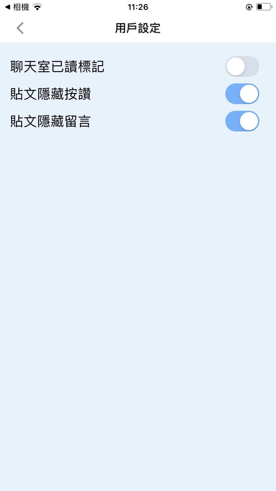

## 💬 聊天室功能
 ✅一對一聊天僅在雙方為好友後才啟用 
 🛠 以 Supabase Realtime 建立訊息即時同步 
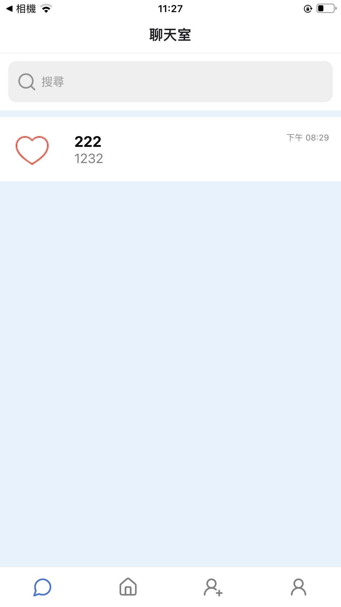
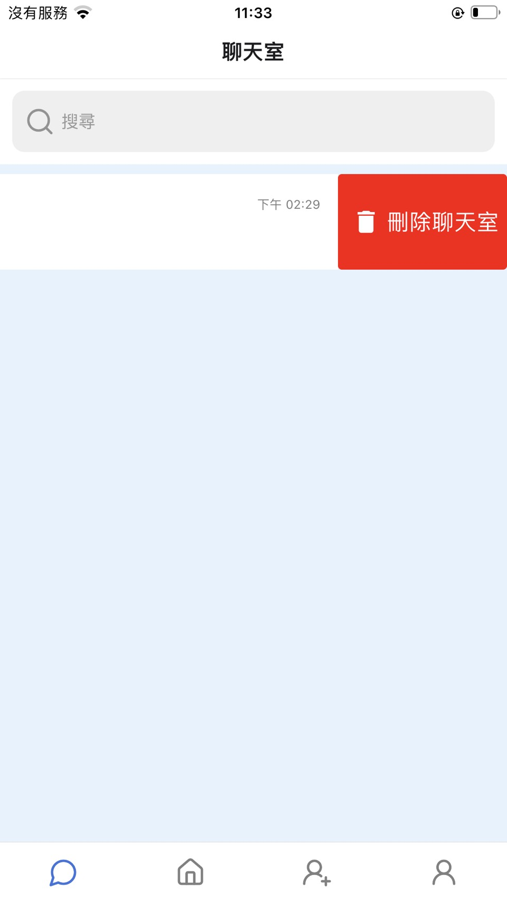
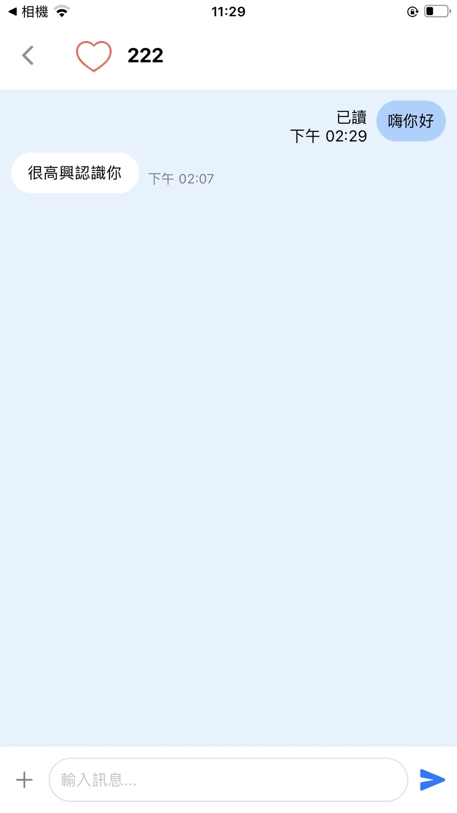

